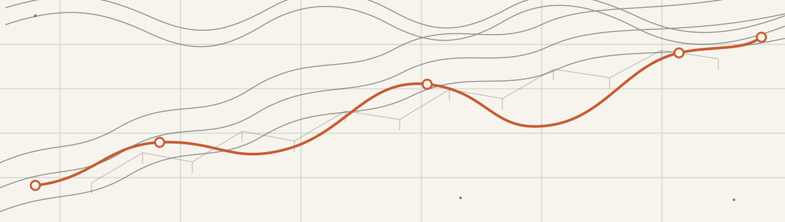

<picture>
  <source media="(prefers-color-scheme: dark)" srcset="./assets/contour-hero-dark.svg">
  <source media="(prefers-color-scheme: light)" srcset="./assets/contour-hero-light.svg">
  
</picture>

# Anmol Dhiman

Software engineer focused on **AI, automation, and secure systems**.

I study Information Systems Engineering at Humber Polytechnic, with a focus on cybersecurity. My work moves between applied machine learning, data pipelines, performance-oriented systems, and practical automation.

<a href="https://anmold.dev">Portfolio</a> · <a href="https://linkedin.com/in/anmoldhimann">LinkedIn</a> · <a href="mailto:contact@anmold.dev">Email</a>

## Selected work

Five projects that show the range of that work: from model pipelines and geospatial processing to auditable reporting, embedded control, and developer tooling.

### [AI Trading Arena](https://github.com/Anmol-STRS/AITraderBotMLProject)

Full-stack educational and research project for stock-price prediction and agent-assisted market analysis on TSX-listed companies. It combines XGBoost models built from 40+ technical indicators with a Flask API and React/TypeScript dashboard.

`Python` · `XGBoost` · `Flask` · `React` · `TypeScript`

### [Terrain Builder](https://github.com/Anmol-STRS/TerrainBuilderI-0)

Documentation-only public release for a high-performance C++ preprocessing pipeline for large Digital Elevation Model (DEM) datasets. The repository covers spatial indexing, chunk planning, cached I/O, SIMD kernels, and GeoTIFF output.

`C++` · `GDAL` · `PROJ` · `AVX2` · `CMake`

### [Humber Workbook Insights](https://github.com/Anmol-STRS/Humber-Workbook-Insights)

Portfolio showcase for a private Python system that parses Excel assessment results, automates CLO → Indicator binning, exports Excel and PDF reports, and provides Tkinter and Streamlit interfaces with step-by-step logging.

`Python` · `Pandas` · `OpenPyXL` · `Streamlit` · `SQLite`

### [Arduino Car](https://github.com/Anmol-STRS/Arduino-Car-w-Obstacle-Detection)

Arduino UNO robotics project combining IR line-following, ultrasonic obstacle avoidance, and Bluetooth remote control in one compact platform.

`Arduino C/C++` · `Arduino UNO R3` · `HC-SR04` · `HC-05`

[Watch the live demo →](https://youtu.be/_BBaOZrlC_I)

### [Project README Generator](https://github.com/Anmol-STRS/projectreadmegenerator)

Python script that turns answers about a project into structured Markdown README files, with selectable sections such as installation, usage, contributing, and license.

`Python` · `Markdown`

## Focus

- Applied machine learning and model-backed analysis
- Data processing pipelines and repeatable automation
- Performance-oriented C++ and geospatial systems
- Cybersecurity-focused engineering and secure systems

## Connect

If you are hiring, collaborating, or want to talk through a project:

- [anmold.dev](https://anmold.dev)
- [linkedin.com/in/anmoldhimann](https://linkedin.com/in/anmoldhimann)
- [contact@anmold.dev](mailto:contact@anmold.dev)
