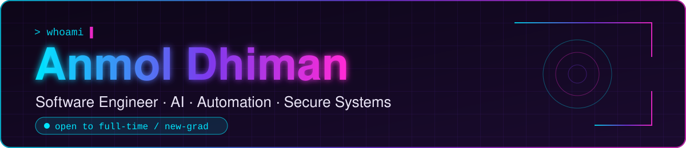
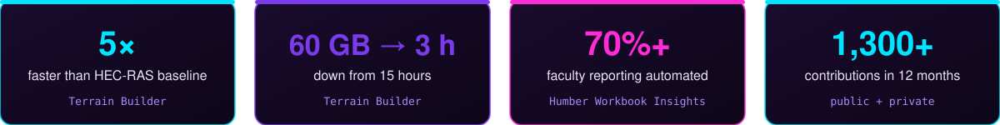
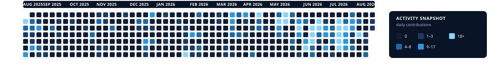

  

  
  
  

  <a href="https://anmold.dev"><b>Portfolio</b></a> ·
  <a href="https://linkedin.com/in/anmoldhimann">LinkedIn</a> ·
  <a href="mailto:contact@anmold.dev">Email</a>

## ⚡ Impact at a glance

  

## 👋 About

I take an idea past the prototype: trace the failure, automate the repeatable work, and ship the next version. I like problems where performance, correctness, and trust all matter at once, whether that is a C++ pipeline chewing through tens of gigabytes of elevation data or a reporting system that faculty rely on for accreditation.

I study Information Systems Engineering at Humber Polytechnic with a focus on cybersecurity, and my work spans applied machine learning, data pipelines, performance-oriented systems, and practical automation.

## 🧭 Leadership

> **Technical Lead · GACI Online** — *Private Humber internal platform*
>
> Leading an internal admin platform for CLO mapping, workbook imports, and graduate-attribute analytics.

## 🚀 Featured projects

### Terrain Builder — high-performance geospatial pipeline
[**Repository →**](https://github.com/Anmol-STRS/TerrainBuilderI-0) *(documentation-only public release)*

A C++ preprocessing pipeline that merges large Digital Elevation Model (DEM) datasets into unified terrain grids for hydraulic modelling workflows such as HEC-RAS.

| Metric | HEC-RAS baseline | Terrain Builder |
|---|---|---|
| Processing time (360 files, 60 GB) | 15 hours | **3 hours** |
| Throughput | 1.1 MB/s | **6.3 MB/s** |
| Memory footprint | Variable | **Constant, 622 MB** |

- **Four-phase pipeline:** parallel discovery, R-tree spatial indexing, chunk planning (9,604 chunks per run), cached windowed I/O, compressed tiled GeoTIFF output.
- **Performance engineering:** LRU block cache with a 40–60% hit rate and AVX2 SIMD kernels for a 2.5× processing speedup.

`C++` · `GDAL` · `PROJ` · `AVX2` · `CMake`

---

### Humber Workbook Insights — accreditation reporting automation
[**Repository →**](https://github.com/Anmol-STRS/Humber-Workbook-Insights) *(portfolio showcase; source is private under NDA)*

A Python system that parses Excel assessment results, automates CLO → Indicator binning, and exports polished Excel and PDF reports. Used across **4+ engineering programs** and automates **70%+ of manual faculty reporting**.

- Tkinter desktop app with multithreaded Excel processing, plus CLI and Streamlit interfaces.
- Indicator-, CLO-, and Level-I/D/A summaries, with step-by-step logging for traceability and audit.
- Private code walkthrough or demo available on request.

`Python` · `Pandas` · `OpenPyXL` · `Streamlit` · `SQLite`

---

### AI Trading Arena — ML + LLM market research platform
[**Repository →**](https://github.com/Anmol-STRS/AITraderBotMLProject)

A full-stack research project for TSX stock-price prediction and agent-assisted market analysis. It combines symbol-specific **XGBoost** models built from **40+ technical indicators** (optional CUDA acceleration) with LLM agents from Claude, GPT, and DeepSeek, served through a Flask API with WebSockets and a React/TypeScript dashboard.

- Compare model metrics, feature importance, and predictions in one dashboard.
- LLM agents interpret technical analysis, score sentiment, and flag risk factors, with cost tracking.
- Educational and research use only; not financial advice.

`Python` · `XGBoost` · `Flask` · `React` · `TypeScript` · `SQLite`

---

### Arduino Car — embedded control
[**Repository →**](https://github.com/Anmol-STRS/Arduino-Car-w-Obstacle-Detection) · [**Live demo →**](https://youtu.be/_BBaOZrlC_I)

An Arduino UNO robot combining IR line-following, ultrasonic obstacle avoidance, and Bluetooth remote control, with sensor inputs processed at 100 Hz.

- **17/18 laps** completed on a 2 m test track (94.4%).
- **48 ms** average full stop on obstacle detection.
- **~45 minutes** runtime on a single 7.4 V LiPo pack.

`Arduino C/C++` · `HC-SR04` · `HC-05` · `L298N`

---

### Project README Generator — developer tooling
[**Repository →**](https://github.com/Anmol-STRS/projectreadmegenerator)

A Python script that turns answers about a project into structured Markdown READMEs, with selectable sections such as installation, usage, contributing, and license.

`Python` · `Markdown`

## 🛠 Skills

  <b>Languages</b> 
  
  
  
    
  <b>AI & data</b> 
  
  
  
    
  <b>Backend & web</b> 
  
  
  
    
  <b>Systems & tooling</b> 
  
  
  
    

Also: Excel/PDF report automation · feature engineering · memory-mapped I/O · cybersecurity focus at Humber Polytechnic

## 📈 Contribution snapshot

  

**1,300+ contributions · August 11, 2025 – August 11, 2026 · 53 weeks**

Dated GraphQL snapshot of contribution activity. This includes public and private work; private repository details remain private.

## 📬 Let's talk

I'm looking for full-time and new-grad software roles. If you're hiring, collaborating, or want to talk through a project:

- 🌐 [anmold.dev](https://anmold.dev)
- 💼 [linkedin.com/in/anmoldhimann](https://linkedin.com/in/anmoldhimann)
- ✉️ [contact@anmold.dev](mailto:contact@anmold.dev)
